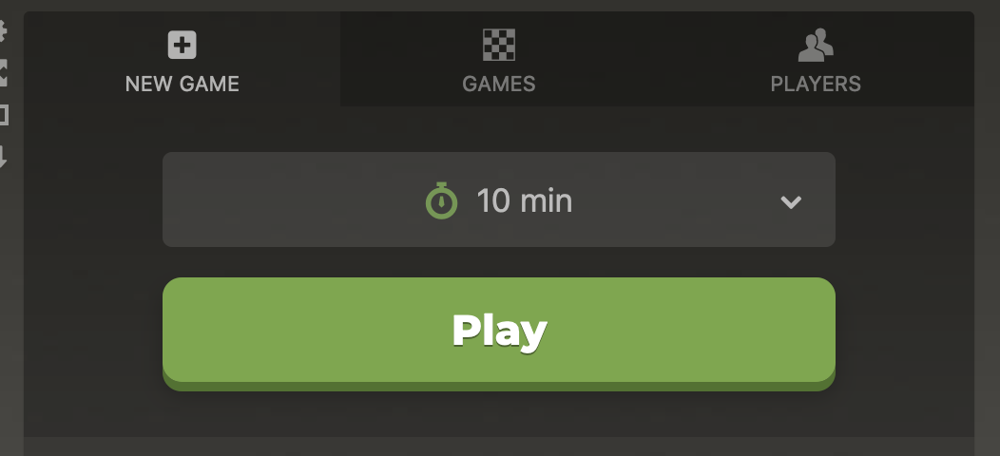
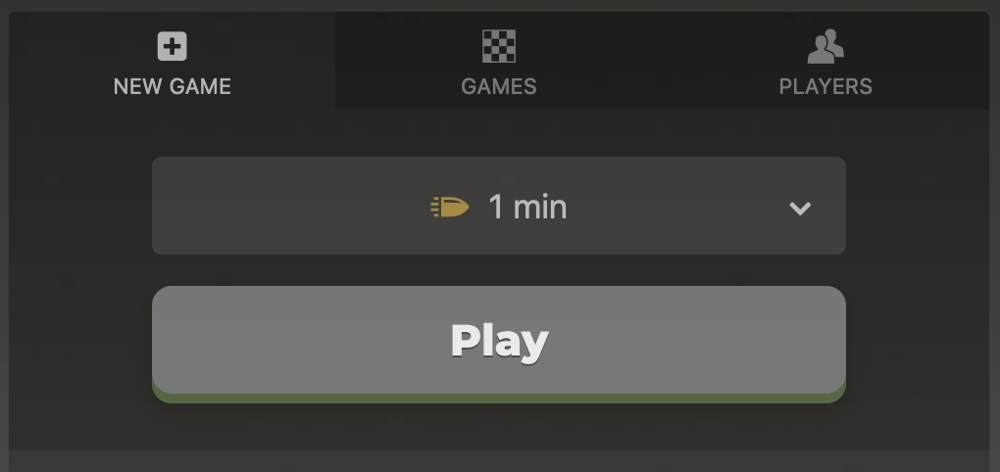

# Chess extension

Improving at chess requires to play long time controls (at least 10 minutes per player). However shorter time controls like Bullet and Blitz are more fun to play.

This extension disables the option to play fast time formats on chess.com, so that I can focus on improving.

# Examples

Go to https://www.chess.com/play/online

If you select 10 minutes or above, you can press Play



Otherwise the button will be disabled



# Install

## Debug mode

1. Go to about:debugging in Firefox
2. Click on This Firefox
3. Load Temporary Add on
4. Find manifest.json

## Production mode

Run this command to generate a zip containing the extension
```
npm run package
```

Then steps 1. 2. and 3. above ^
And select the extension.zip

# Useful links

- https://developer.mozilla.org/en-US/docs/Mozilla/Add-ons/WebExtensions/Your_first_WebExtension
- https://developer.mozilla.org/en-US/docs/Mozilla/Add-ons/WebExtensions/Your_second_WebExtension
